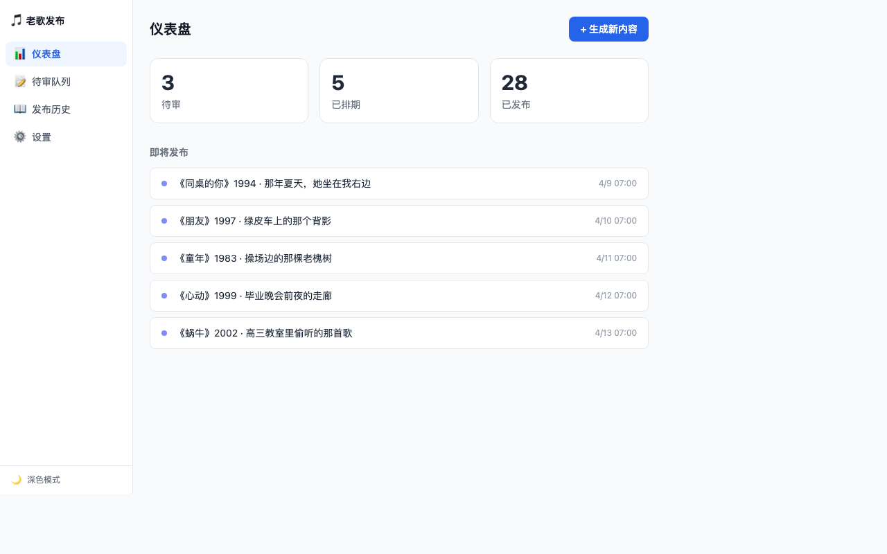
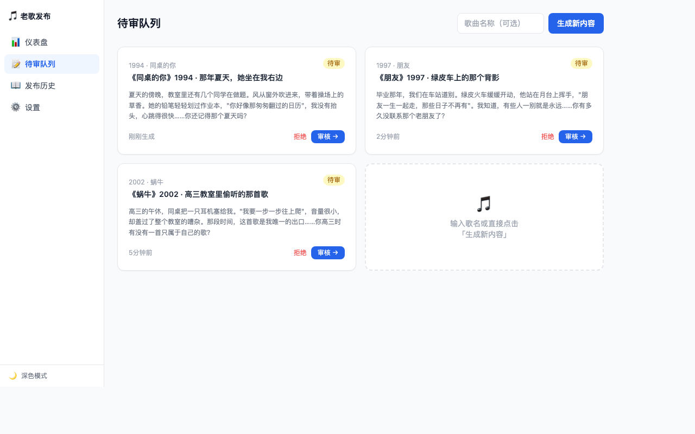
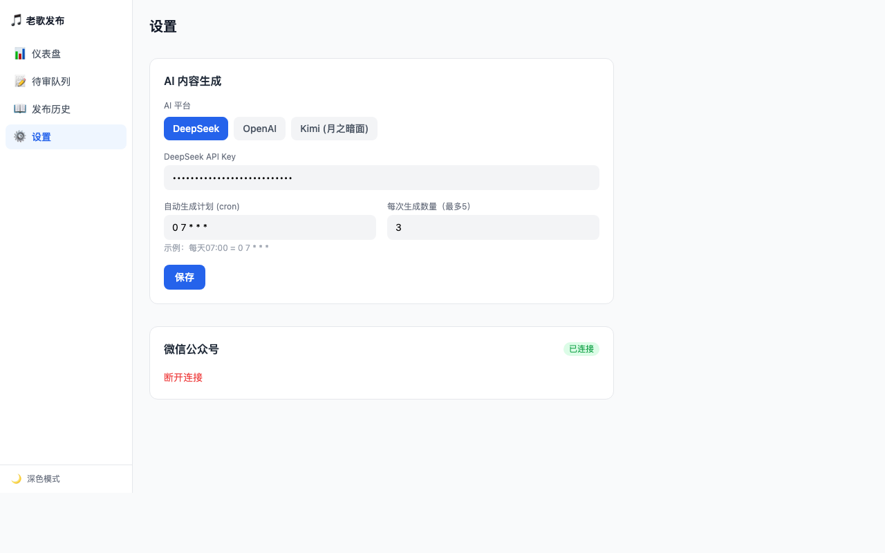

# 🎵 老歌发布 · Nostalgic Publisher

> 用 AI 把你的怀旧老歌记忆变成公众号内容，自动排期、一键发布。

一款基于 Electron 的桌面工具，接入 AI（DeepSeek / OpenAI / Kimi）自动为经典老歌写青春故事，内容经你审核后定时推送至微信公众号。

---

## 截图

### 仪表盘 — 内容概览与排期


### 待审队列 — 审核 AI 生成的内容


### 设置 — 切换 AI 平台


---

## 核心功能

| 功能 | 说明 |
|------|------|
| 🤖 AI 内容生成 | 支持 DeepSeek / OpenAI / Kimi，一键切换 |
| 📝 内容审核 | 生成后先进队列，你审核通过再排期 |
| ⏰ 定时发布 | Cron 表达式配置，每天固定时间自动推文 |
| 📱 微信公众号 | 接入公众号 API，自动发布图文 |
| 🌗 深色模式 | 跟随系统或手动切换 |

---

## 快速开始

### 环境要求

- Node.js ≥ 18
- macOS / Windows / Linux

### 安装

```bash
git clone https://github.com/YOUR_USERNAME/nostalgic-publisher.git
cd nostalgic-publisher
npm install
```

### 开发模式

```bash
npm run dev
```

### 打包

```bash
# macOS
npm run build:mac

# Windows
npm run build:win

# Linux
npm run build:linux
```

---

## 使用方法

### 第一步：配置 AI 平台

打开 **设置 → AI 内容生成**，选择你的 AI 平台并填入 API Key：

| 平台 | 获取地址 | 模型 |
|------|---------|------|
| **DeepSeek**（推荐） | [platform.deepseek.com](https://platform.deepseek.com) | deepseek-chat |
| **OpenAI** | [platform.openai.com](https://platform.openai.com) | gpt-4o-mini |
| **Kimi** | [platform.moonshot.cn](https://platform.moonshot.cn) | moonshot-v1-8k |

点击 **保存**。

### 第二步：连接微信公众号（可选）

1. 前往 [微信公众平台](https://mp.weixin.qq.com) → 设置 → 开发设置
2. 获取 **AppID** 和 **AppSecret**
3. 填入设置页面，点击 **连接**

> ⚠️ 自动发布需要**服务号**权限，订阅号仅支持手动发布。

### 第三步：生成内容

在 **仪表盘** 或 **待审队列** 点击「+ 生成新内容」，或者输入指定歌名后生成。

AI 会以经典老歌为背景，写一段 200 字以内的青春故事，包含：
- 具体场景（暗恋 / 毕业 / 旅途 / 网吧 / 绿皮车…）
- 歌词引用
- 与读者互动的结尾问句

### 第四步：审核 & 排期

在待审队列中：
- 点击 **审核 →** 进入编辑器，可修改标题、正文，选择发布平台和时间
- 点击 **拒绝** 丢弃这篇文章，重新生成

### 第五步：自动发布

配置 **Cron 表达式**（默认 `0 7 * * *` = 每天早上 7 点），应用会在后台定时检查排期内容并自动发布。

---

## 项目结构

```
src/
├── main/                  # Electron 主进程
│   ├── db/                # SQLite 数据层（文章、设置、平台、记录）
│   ├── services/
│   │   ├── generator.ts   # AI 内容生成（多平台）
│   │   ├── wechat.ts      # 微信公众号发布
│   │   └── toutiao.ts     # 头条发布
│   ├── ipc.ts             # IPC 通信桥
│   └── scheduler.ts       # 定时任务
└── renderer/              # React 前端
    ├── pages/             # 仪表盘 / 队列 / 编辑器 / 历史 / 设置
    ├── components/        # Sidebar、ArticleCard、ThemeToggle
    └── stores/            # Zustand 状态管理
```

---

## 技术栈

- **框架**：Electron + electron-vite
- **前端**：React 19 + Tailwind CSS
- **状态**：Zustand
- **数据库**：better-sqlite3
- **AI SDK**：openai（兼容 DeepSeek / OpenAI / Kimi）
- **定时任务**：node-cron

---

## License

MIT
